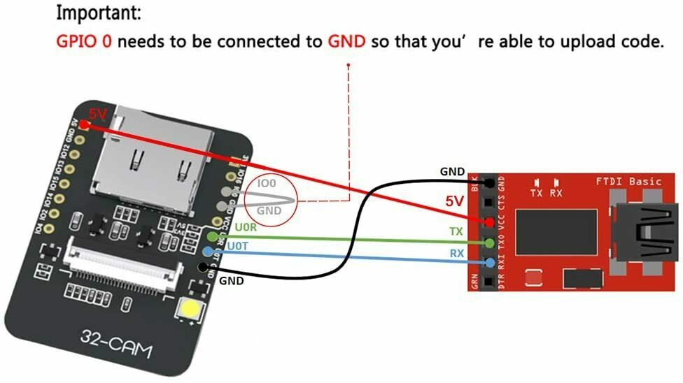
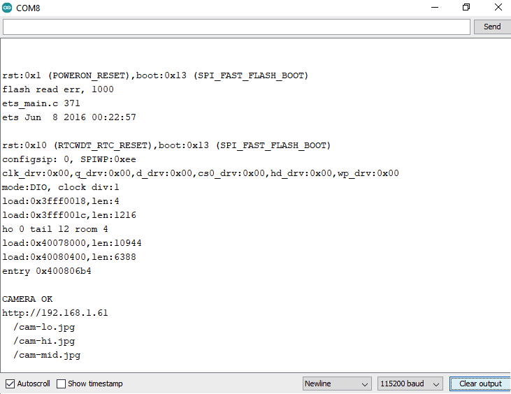
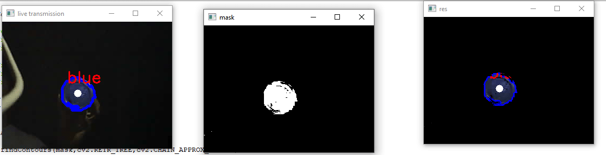

## Projeto Final INF538

Para inicializar o projeto é preciso rodar o programa arduino-esp32-cam, para isso utilizamos um módulo USB-to-TTL que possibilita a programação da placa.

Utilizamos [a biblioteca chamada esp32cam](https://github.com/yoursunny/esp32cam) para realizar a manipulação da placa ESP32-CAM, para isso precisamos instalar ela na IDE Arduino. Substituindo as variáveis "WIFI_SSID" e "WIFI_PASS" pelos identifiantes de uma rede WiFi, tivemos o seguinte resultado no console Arduino:

Com isso conseguimos obter o valor do IP para utilizar no código em Python, tivemos que instalar duas dependencias para poder desenvolver o projeto: `numpy` e `opencv-python`. Assim através do código do repositório em questão conseguimos identificar a cor dos objetos azuis capturados pela ESP32-CAM:

